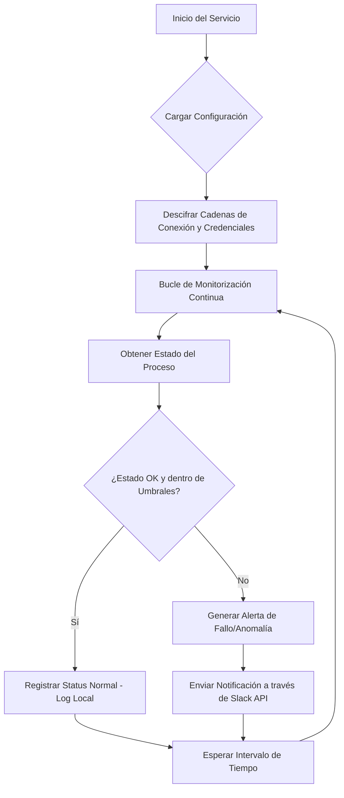

# MonitorTasks

## 💻 Introducción y Objetivo

Este repositorio contiene una solución de software diseñada para la **monitorización y gestión de tareas de sistemas** dentro de un entorno de hardware específico.

El **objetivo principal** es automatizar la supervisión de procesos críticos, notificar sobre su estado y permitir acciones de control básico. Esto asegura la operatividad y rendimiento de los sistemas de hardware mediante la detección temprana de anomalías y la gestión eficiente de los flujos de trabajo.

-----

## ⚙️ Tecnologías Usadas

El proyecto se construyó utilizando un *stack* de tecnologías enfocado en la fiabilidad, el rendimiento, la **seguridad** y la integración de servicios.

  * **Lenguaje de Programación:** Python 🐍
      * *Razón:* Amplia librería para interacción con el sistema operativo y desarrollo rápido.
  * **Gestión de Dependencias:** `pip` / `requirements.txt`
  * **Base de Datos (Opcional/Generalizada):** SQLite o un sistema de almacenamiento de datos ligero.
      * *Razón:* Almacenamiento local de logs y estados de tareas.
  * **Sistema de Notificaciones:** **Slack API** 💬
      * *Razón:* Envío de alertas y reportes en tiempo real a canales designados.
  * **Seguridad de la Configuración:** **Librería de Cifrado** (ej. `cryptography`)
      * *Razón:* Protección de datos sensibles, como tokens de Slack y otras credenciales de acceso, asegurando que las cadenas de conexión estén cifradas en reposo.
  * **Librerías Clave (Ejemplos):**
      * `psutil`: Para acceder a la información de procesos y utilización del sistema.
      * Librerías específicas para la interacción con la API de Slack.

-----

## 🚀 Instalación y Uso

A continuación se detalla cómo configurar y ejecutar la solución en un entorno local o de destino.

### 📥 Instalación

1.  **Clonar el repositorio:**
    ```bash
    git clone https://github.com/YuridiaPerez/MonitorTasks.git
    cd MonitorTasks
    ```
2.  **Crear un entorno virtual (opcional pero recomendado):**
    ```bash
    python -m venv venv
    source venv/bin/activate  # En Linux/macOS
    # .\venv\Scripts\activate # En Windows
    ```
3.  **Instalar las dependencias:**
    ```bash
    pip install -r requirements.txt
    ```
4.  **Configuración de Seguridad:**
      * Las **cadenas de conexión sensibles (como tokens de Slack o claves API) deben estar cifradas** en el archivo de configuración. Se debe usar una clave maestra de entorno (o similar) para descifrar estos valores solo en tiempo de ejecución.
      * Editar el archivo de configuración (ej. `config.ini`) para especificar las tareas a monitorizar, umbrales de alerta y los *webhooks* de Slack.

### ▶️ Uso

Para iniciar el servicio de monitorización, ejecute el script principal:

```bash
python main_monitor.py
```

*(El nombre del script puede variar, por ejemplo, `start.py` o `monitor_service.py`)*

El servicio:

1.  **Descifra** las cadenas de conexión al inicio.
2.  Verifica el estado de las tareas y procesos.
3.  Registra el *status* y los eventos.
4.  Emite alertas (a través de la **API de Slack**) si se detectan fallos o se superan los umbrales.

-----

## 🧠 Lecciones Aprendidas / Habilidades Demostradas

Este proyecto permitió desarrollar y aplicar habilidades críticas en la ingeniería de sistemas, la seguridad y la integración de servicios.

| Habilidad Demostrada | Lección Aprendida |
| :--- | :--- |
| **Implementación de Seguridad** | La necesidad crítica de **cifrar las cadenas de conexión y credenciales** para evitar la exposición de datos sensibles en repositorios o entornos de despliegue. |
| **Integración con APIs Externas** | Implementación exitosa y gestión de la **API de Slack** para un sistema de alertas proactivo y centralizado. |
| **Programación de Sistemas (Python)** | Dominio de la interacción a bajo nivel con el sistema operativo para la gestión de procesos y tareas. |
| **Diseño de Arquitecturas Modulares** | Separación clara entre la lógica de monitorización, el cifrado, la configuración y el mecanismo de notificación para facilitar el mantenimiento. |
| **Gestión de Recursos y Tareas** | La importancia de la monitorización continua para mantener la estabilidad del sistema y prevenir fallos catastróficos. |

-----

## 📊 Diagrama de Flujo de la Aplicación

El siguiente diagrama muestra el flujo de trabajo principal del servicio de monitorización:



**Flujo en Texto:**

1.  **Inicio del Servicio:** La aplicación comienza a ejecutarse.
2.  **Cargar Configuración:** Lee el archivo de configuración, que incluye las tareas a vigilar y las credenciales cifradas.
3.  **Descifrar Credenciales:** Utiliza la clave de entorno para **descifrar de forma segura las cadenas de conexión** de la API de Slack.
4.  **Bucle de Monitorización:** Entra en un ciclo infinito de vigilancia.
5.  **Obtener Estado:** Consulta el estado y los recursos (CPU/Memoria) de la tarea o proceso objetivo.
6.  **Verificar Umbrales:** Comprueba si el estado es anómalo (caído, usando demasiados recursos, etc.).
7.  **Ruta Normal:** Si está bien, registra el estado en el **Log Local**.
8.  **Ruta de Alerta:** Si hay un fallo, genera un mensaje de alerta.
9.  **Notificación Externa:** Envía el mensaje de alerta inmediatamente a través de la **Slack API**.
10. **Espera e Iteración:** Espera el intervalo de tiempo configurado y repite el ciclo.

-----

## 🏷️ Etiquetas (Topics)

`system-monitoring` | `hardware-management` | `python` | `process-management` | `automation` | `task-scheduler` | `slack-api` | `encryption` | `security` | `devops` | `system-utilities`
